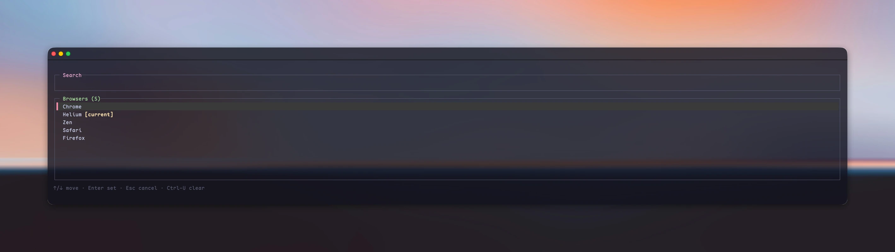

# defbrow

**A — framing as shot** (WebP, 45 KB, down from a 1.2 MB PNG)

**B — empty list area squeezed** (WebP, 29 KB) — same layout, but the terminal's vertical gradient is compressed ~15x where nothing is drawn, which shows as a soft shadow band above the footer.

A small Rust CLI for choosing the default browser on macOS and Linux, with a searchable ratatui picker that inherits your terminal colors.

Run `defbrow` for the picker, or use `list`, `current`, and `set <id-or-name>`.

See [usage, requirements, and build instructions](docs/usage.md).
