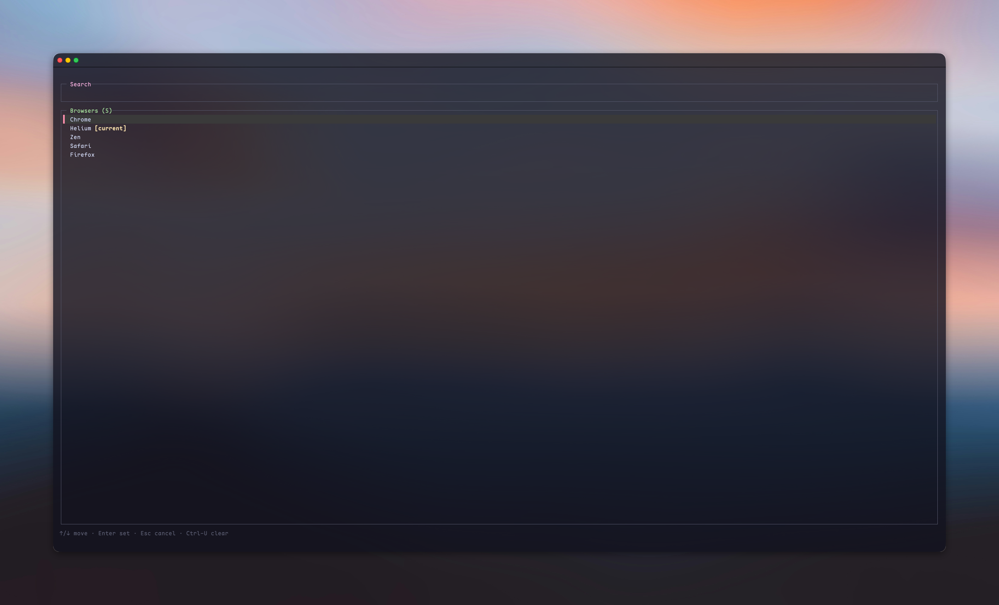

# defbrow

A small Rust CLI for choosing the default browser on macOS and Linux, with a searchable ratatui picker that inherits your terminal colors.

Run `defbrow` for the picker, or use `list`, `current`, and `set <id-or-name>`.

See [usage, requirements, and build instructions](docs/usage.md).
