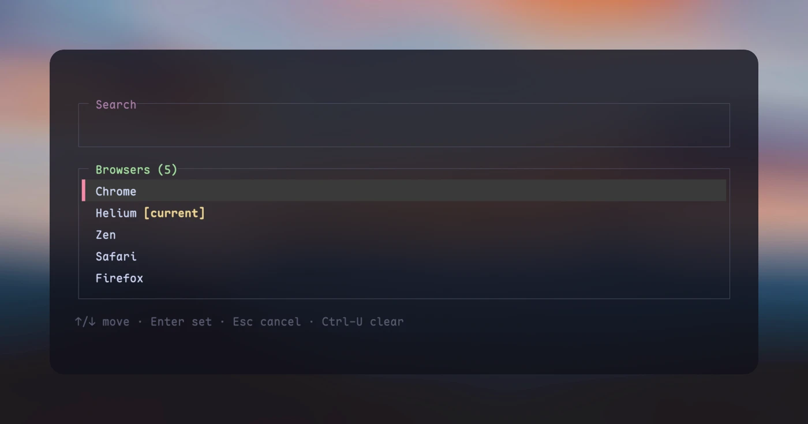

<h1 align="center">defbrow</h1>

<p align="center">A searchable default-browser picker for macOS and Linux, built with Rust and ratatui.</p>

<p align="center">
  <a href="https://github.com/lmilojevicc/defbrow/actions/workflows/ci.yml"></a>
  <a href="https://github.com/lmilojevicc/defbrow/graphs/contributors"></a>
  <a href="https://github.com/lmilojevicc/defbrow/blob/main/LICENSE"></a>
</p>

<p align="center">
  
</p>

Choose from registered HTTP and HTTPS handlers with a fuzzy-search picker that inherits your terminal colors. Run `defbrow` for the picker, or use `list`, `current`, and `set <id-or-name>`.

## Build and install from source

Requires stable Rust; macOS 12+ also needs Apple's Command Line Tools. On Linux, install `xdg-utils` with your distribution's package manager and use your graphical desktop session.

```sh
cargo install --path . --locked --root "$HOME/.local"
# Add $HOME/.local/bin to PATH.
defbrow --help
```

See [usage, platform requirements, and build instructions](docs/usage.md).
